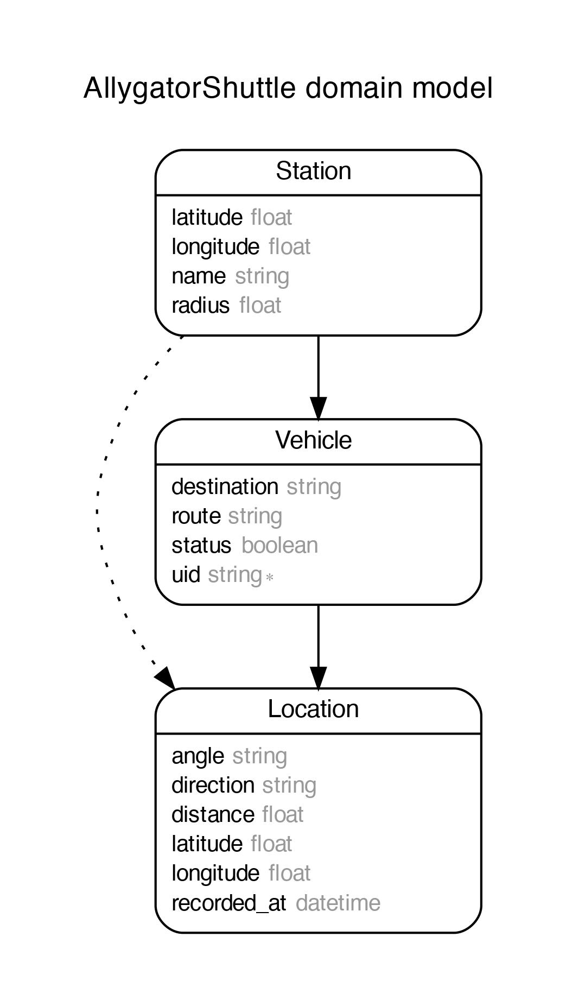
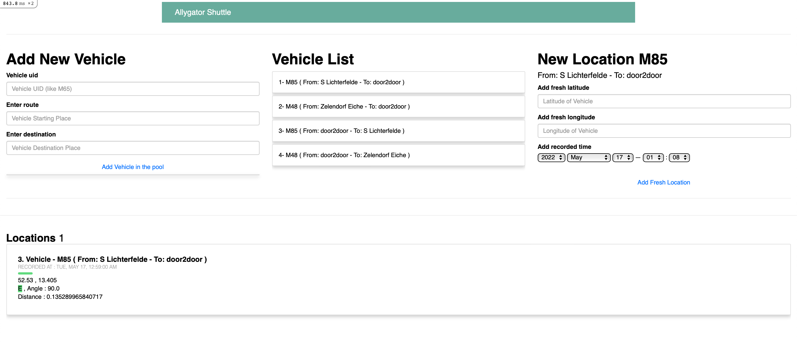
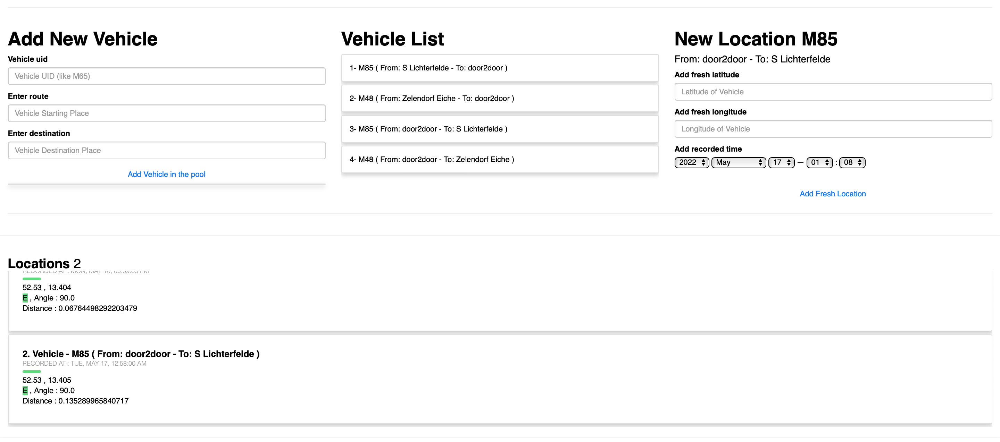
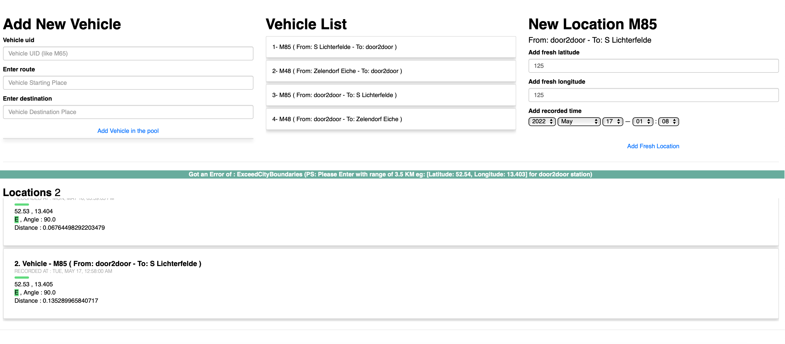

# Learning Assessment
## Allygator Shuttle

The aim is to express my level of skills and knowledge as they are required to deal with everyday tasks as a Full Stack Engineer.
To achieve this purpose, I completed all tasks while keeping in mind the task definition.

Solution:
* I used Ruby on Rails Framework for Development.
  (Reason to choose this framework bcz it's a monolithic application which provide my complete backend and frontend within the same application.)
* Ruby (Version: 2.7.1)
    * CMD (bundle install)
* Rails (Version: 6.1.5)
* Database - PostgreSQL
* Application is exposed using Dockerization container on Web
* Database creation
* Database initialization
    * CMD (rake db:setup)
    * I added initial records in db:seed

* For Test Cases I used (Rspec)
* How to run the test suite
    * CMD (docker-compose run --rm web bundle exec rspec spec)

* Running instructions:
    * CMD (rails s)
    * View on any Web Using any Agent (eg: Chrome)
    * Type: localhost:3000/

## Run the Rails Application using Docker Container

host: localhost -> host: database

##### Please run these commands to complete setup:


```
docker-compose up --build

or

docker compose build
docker-compose run web rake db:create
docker-compose run --rm web bundle exec rake db:migrate
docker-compose run --rm web bundle exec rake db:seed
docker compose up
```
*PS: If you're using MAC then it cause an issue in "apt-get update" cmd in Docker, the solution to this problem is going to "Screen Time" setting and change the settings to "Unrestricted web access".

##### If you wish to run without docker
##### Then just uncomment 3 lines in database.yml
##### Which includes host, username, and password.
##### Lastly, Run these command on Terminal:
```
    Bundle install
    Rake db:create
    Rake db:setup
    Rails s
```


## Overview

Here Applications has three models according to the following database scheme.
* Station where we can save the detail of stations like on of the example is door2door office is a station. 
* Vehicles which carry the detail of vehicles which are onboard.
* Locations in which we can save the detail of locations like latt, long, angle, direction and distance.
* Relations between these models are like: Stations has_many vehicles has_many locations.



1. `http://localhost:3000` Landing Page.
    ```
   - Here we can add new vehicle.
        1. Add Uid (Like M29)
        2. Starting Station.
        3. Destination Station.
   - Next, List of all the vehicles in the scrollable list in the next column.
   - After selecting specific vehicle from the scrollable list you can add a new location.
      (PS: Location must be in-range of Station radius like door2door radius is 3.5 KM. )
   ```
   

2. `http://localhost:3000` Locations List
    ```
   - Here we have the location list of all vehicles that are recorded within the range.
   - In each card, I'm showing the Vehicle detail and location detail which contains following things:
        1.  Location Recorded At.
        2.  Latitude, Longitude of location
        3.  Direction of Vehicle (Record on the basis of last location)
        4.  Angle of Vehicle (Recorded on the basis of last location, if not present than on the basis of station)
        5.  Distance from the station.
   ```
      

3. `http://localhost:3000` Error Possible.
    ```
    - If we add location out of the City Boundaries then it doesn't save the location and sends you an error.
    - if we add location with-in 3 seconds the it shows uss the response that "Lessthan3Seconds" error and same it doesn't save the record.
   ```
   

    ```
    - Every New location can be added by Action Cable Method which is like a socket connection for rails based Application.
    - You can view the connection details in the inspect console as well.
    - And after adding each location you can view the updated location without page reload.
    - Lastly when vehicles changed the old connection disconnected. 
    ```

### Landing Page of Allygator Shuttle Service in Rails

```
Views are just simple to express and shows vehicles and locations. 
Definitely it can be improved on the basis of demand. 
```


## That's ALL, Folks!

###

##### *** In case something isn't clear or any issue while setup, feel free to contact me. Email Address: hamidiqbal598@gmail.com

## GOOD BYE

